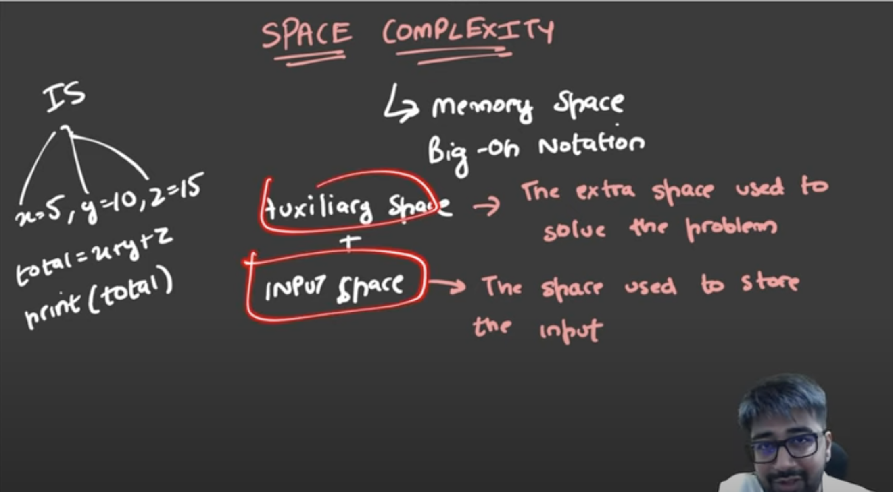

# Space Complexity

## Definition

**Space Complexity** is a measure of the amount of memory (space) an algorithm uses relative to the input size. It quantifies how the memory requirements of an algorithm grow as the size of the input data increases.

## Key Components

1. **Auxiliary Space**: Extra space used by the algorithm (excluding the input space)
2. **Input Space**: Space required to store the input data
3. **Total Space**: Auxiliary space + Input space

## Common Space Complexities

### O(1) - Constant Space
Algorithm uses a fixed amount of extra space regardless of input size.

**Example:**
```python
def find_max(arr):
    max_val = arr[0]  # Only one extra variable
    for num in arr:
        if num > max_val:
            max_val = num
    return max_val
```

### O(n) - Linear Space
Space usage grows proportionally with input size.

**Example - Array Creation:**
```python
def reverse_array(arr):
    reversed_arr = []  # New array of size n
    for i in range(len(arr)-1, -1, -1):
        reversed_arr.append(arr[i])
    return reversed_arr
```

**Example - Recursion:**
```python
def factorial(n):
    if n <= 1:
        return 1
    return n * factorial(n-1)  # Each call uses stack space
```

### O(n²) - Quadratic Space
Space usage grows quadratically with input size.

**Example:**
```python
def create_matrix(n):
    matrix = []
    for i in range(n):
        row = [0] * n  # Creating n×n matrix
        matrix.append(row)
    return matrix
```

### O(log n) - Logarithmic Space
Space usage grows logarithmically with input size.

**Example - Binary Search (Recursive):**
```python
def binary_search(arr, target, left, right):
    if left > right:
        return -1
    
    mid = (left + right) // 2
    if arr[mid] == target:
        return mid
    elif arr[mid] > target:
        return binary_search(arr, target, left, mid - 1)
    else:
        return binary_search(arr, target, mid + 1, right)
```

## Important Notes

- **In-place algorithms** typically have O(1) space complexity as they modify the input without using extra space
- **Recursive algorithms** often have space complexity equal to the depth of recursion due to call stack usage
- When analyzing space complexity, we usually focus on **auxiliary space** rather than total space
- Space-time tradeoffs are common - sometimes using more space can reduce time complexity

## Space vs Time Complexity

| Algorithm | Time Complexity | Space Complexity | Trade-off |
|-----------|----------------|------------------|-----------|
| Bubble Sort | O(n²) | O(1) | Time for Space |
| Merge Sort | O(n log n) | O(n) | Space for Time |
| Quick Sort | O(n log n) avg | O(log n) avg | Balanced |
| Hash Table | O(1) avg | O(n) | Space for Time |
